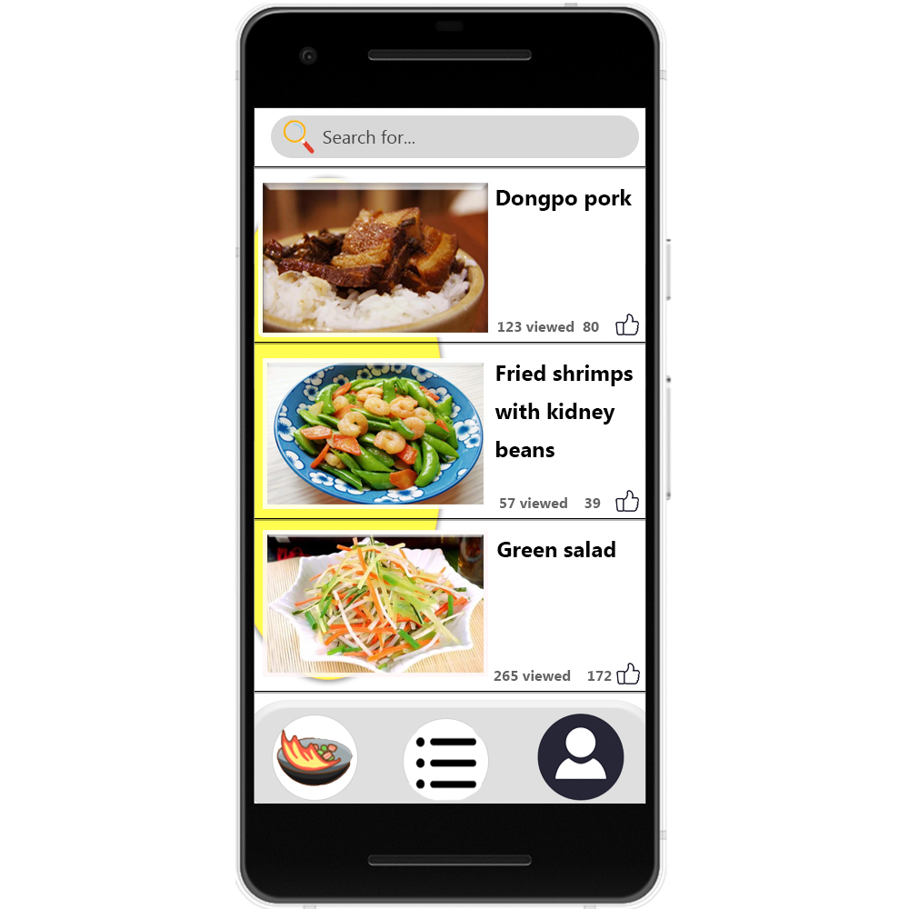

# Cookit!

---

## Design Document  

Kerry Healey, Lilly Schott, Christopher Brown, Zilong Chen

## Introduction 
Have you ever wanted to eat a more balanced diet and don't know what to make?  

Cookit! can help you:
-  Find and create recipes based on your desired nutritional value, cuisine, time, or cooking method
-  Suggest recipes based off your previous meal choices
-  Curate a list of ingredients to add to your next grocery trip

Use your mobile device to find your next balanced meal.  Search and filter within the interface to find a recipe that best fits your individualized needs.
Receive unique notifications of recipes we think you should try.

## Storyboard

## Functional Requirements

### Requirement 100.0: Search for Recipes

#### Scenario

As a user interested in cooking, I want to be able to search for recipes based on cuisine, cooking method, or nutrition so that I can cook tasty, nutritious meals.

#### Dependencies

Recipe data are available and accessible.

#### Assumptions

Recipe names are in English.

#### Examples
1.1  
**Given** a feed of recipe data is available\
**When** I search for "Japanese"\
**Then** I should receive at least one result with the following attribute:\
Cuisine: Japanese

1.2  
**Given** a feed of recipe data is available\
**When** I search for "baking"\
**Then** I should receive at least one result with the following attribute:\
Cooking Method: Baking

1.3  
**Given** a feed of recipe data is available\
**When** I search for "high protein"\
**Then** I should receive at least one result with the following attribute:\
Nutrition: High Protein\
and I should receive at least one result with the attributes:\
Nutrition: High Protein\
Vegan Friendly: Yes

### Requirement 101 Store a Recipe

#### Scenario

As a user interested in cooking, I want to be able to save my personal recipes, including photos, so that I can refine my repices over time.

#### Dependencies

Recipe search data are available and accessible.
The device has a camera and the user has granted camera permissions.

#### Assumptions  

Recipe names are in English.

#### Examples  

2.1
**Given** a feed of recipe data is available\
**Given** camera is available\
**When**\
Select: "Add new recipe"\
Enter:\
Name: Tonkotsu Ramen\
Cuisine: Japanese\
Cooking Method: Boiling\
Nutrition: High Carbs, High Fat, High Protein\
Add photos: *placeholder for image?*\
Tap Save Icon\
**Then**  the new entry for "Tonkotsu Ramen" should be displayed 

2.2
**Given** a feed of recipe data is available\
**When**\
Select: "Add new recipe"\
Enter: no data is entered\
Tap save icon\
**Then** an error dialog appears showing no data was entered.

## Class Diagram

### Class Diagram Description
**MainActivity:** This is the first screen the user will see. There will be a list of dishes from each style and also a an option to enter a new dish/search for a dish. 

**ViewModel:** Shows recipe for the dish, how long it will take to cook, spice level, etc.

**RetrofitClientInstance:** Bootstrap class require for Retrofit.

**Cuisine:** Noun class that represents each dish.

**Recipe:** Noun class that represents the recipes for the dishes. 

**CuisineDAO:** Interface for Retrofit to find and parse Cuisine to JSON.

**RecipeDAO:** Interface for Room to store Recipe data.

## Scrum Roles

- DevOps/Product Owner/Scrum Master: Kerry Healey
- Frontend Developer: Lilly Schott, Zilong Chen
- Integration Developer: Christopher Brown

## Weekly Meeting
After class on Tuesdays via Teams (and Thursdays if needed)
